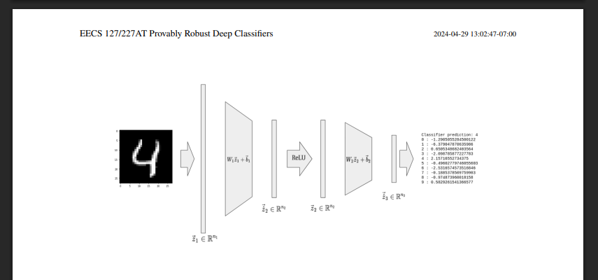
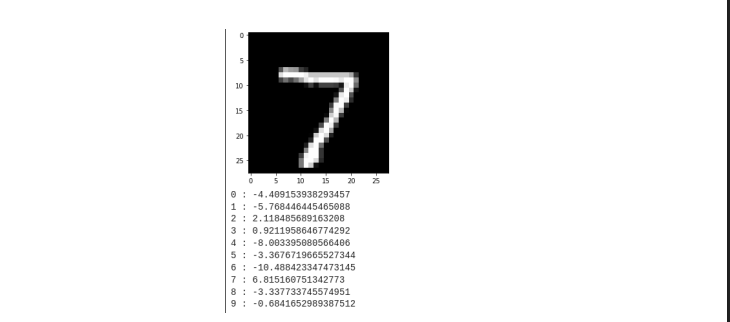
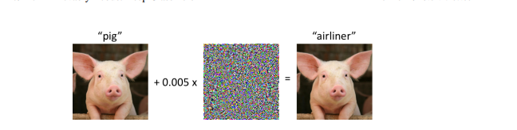
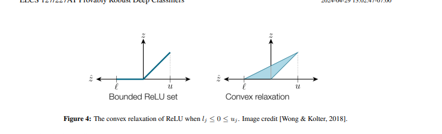

# Provably Robust Deep Classifiers

> Based on the technique by [Wong & Kolter, 2018](https://arxiv.org/abs/1711.00851)

---

## Overview

This project explores how to make neural network classifiers **provably robust** against adversarial attacks. Rather than empirically testing robustness, we frame the problem as a **non-convex optimization problem** and use convex relaxation + Lagrangian duality to derive a **mathematical certificate** of robustness.

The core question: *can we guarantee that no small perturbation of an input will ever fool our classifier?*

---

## The Problem: Adversarial Examples

Standard neural network classifiers are surprisingly fragile. An adversary can apply a tiny, imperceptible perturbation to an input and completely change the classifier's prediction.



> Adding a small perturbation changes model output while keeping the image visually similar.

Formally, the adversary solves:

```
max  L(f_θ(x'), y_true)
s.t. ‖x - x'‖_∞ ≤ ε
```

The adversary wants to find a perturbed input `x'` within an ε-ball of the original `x` that maximizes the classifier's loss.

---

## The Network Architecture

We use a **three-layer feedforward neural network** with ReLU nonlinearity for the MNIST digit classification task.



The network maps an input image `z₁ ∈ ℝⁿ¹` through:
1. **Affine layer:** `ẑ₂ = W₁z₁ + b₁`
2. **ReLU nonlinearity:** `z₂ = ReLU(ẑ₂)`
3. **Affine layer:** `ẑ₃ = W₂z₂ + b₂`
4. **Output:** `f_θ(x) = ẑ₃ ∈ ℝ¹⁰` (one score per digit class)

The classifier assigns the label with the highest score. In the example above, index 4 has the highest value, so the network correctly predicts the digit **4**.

---

## Approach: Convex Relaxation + Duality

### Step 1 — Fast Gradient Sign Method (FGSM)

A simple single-step attack that approximates the adversarial optimization problem:

```
x_FGSM = x + ε · sign(∇_x L(f_θ(x), y_true))
```

This is the solution to a **first-order (linear) approximation** of the adversarial problem under an ℓ∞ constraint, exploiting the fact that the ℓ₁ and ℓ∞ norms are dual.

---

### Step 2 — Convex Relaxation of the Adversarial Problem

The adversarial optimization is non-convex due to the ReLU nonlinearity. We relax it by replacing the ReLU constraint with its **convex hull**.



For each neuron `j` with pre-activation bounds `[lⱼ, uⱼ]`, there are three cases:

| Case | Condition | Relaxation |
|------|-----------|------------|
| Always off | `lⱼ ≤ uⱼ ≤ 0` | Fix `z₂ⱼ = 0` |
| Always on | `0 ≤ lⱼ ≤ uⱼ` | Fix `z₂ⱼ = ẑ₂ⱼ` |
| Uncertain | `lⱼ ≤ 0 ≤ uⱼ` | Convex triangle (shown above, right) |

The relaxed optimum `p*(x, c)` is a **lower bound** on the true adversarial optimum, since we enlarged the feasible set.

---

### Step 3 — Lagrangian Dual Network

Since the relaxed problem can still be large, we derive its **Lagrangian dual**, which turns out to be a backwards pass through a modified version of the original network.

The dual network `g_θ(c)` computes layers `ν₃, ν̂₂, ν₂, ν̂₁` via:

```
ν₃  = −c
ν̂₂  = W₂ᵀ ν₃
ν₂ⱼ = 0                         (j ∈ S⁻, always-off neurons)
ν₂ⱼ = ν̂₂ⱼ                      (j ∈ S⁺, always-on neurons)
ν₂ⱼ = (uⱼ / (uⱼ − lⱼ)) ν̂₂ⱼ   (j ∈ S,  uncertain neurons)
ν̂₁  = W₁ᵀ ν₂
```

The dual objective evaluates to:

```
d*(x, c) = −ν̂₁ᵀx − ε‖ν̂₁‖₁ − Σᵢ νᵢ₊₁ᵀbᵢ + Σⱼ∈S lⱼ · ReLU(ν₂ⱼ)
```

By **weak duality**: `d*(x, c) ≤ p*(x, c) ≤ primal adversarial optimum`

---

### Step 4 — Robustness Certificate

We choose `c = y_true − e_j` for each incorrect class `j`. If:

```
d*(x, cⱼ) > 0   for all j ≠ i_true
```

then the classifier is **provably robust** on input `x`: no ε-perturbation can fool it into choosing any wrong class.

---

### Step 5 — Training a Robust Classifier

Using the dual network, we construct a new training objective that minimizes the **worst-case adversarial loss**:

```
min_θ  Σ_{x ∈ D}  L(−J̃(x, g_θ(y_true · 1ᵀ − I)), y_true)
```

This replaces the standard classifier scores with the dual network's robustness bounds, so gradient descent directly optimizes for certified robustness rather than just average accuracy.

---

## MNIST Example Output



The classifier outputs a score vector of length 10. The top-scoring class is the predicted digit.

---

## Key Results

| Component | Description |
|-----------|-------------|
| FGSM Attack | Single-step ℓ∞ adversarial perturbation |
| Convex Relaxation | Enlarges feasible set via ReLU convex hull |
| Dual Certificate | Provable lower bound via Lagrangian duality |
| Robust Training | Minimizes worst-case loss upper bound |

---

## Tech Stack

- **Python** — core implementation  
- **PyTorch** — neural network training  
- **NumPy** — linear algebra / bound computation  
- **CVXPY** — convex optimization  
- **Jupyter Notebook** — experiments and visualizations  

---

## References

1. E. Wong and Z. Kolter, *"Provable Defenses Against Adversarial Examples via the Convex Outer Adversarial Polytope"*, ICML 2018.  
2. N. Carlini and D. Wagner, *"Towards Evaluating the Robustness of Neural Networks"*, IEEE S&P 2017.

---

